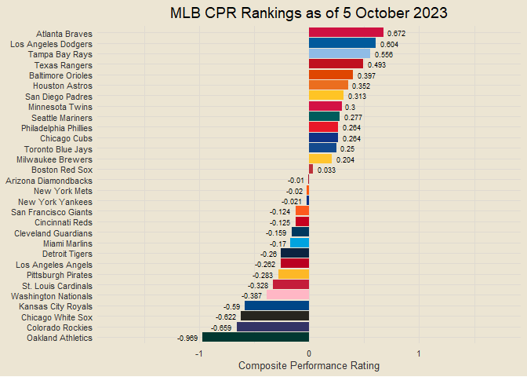
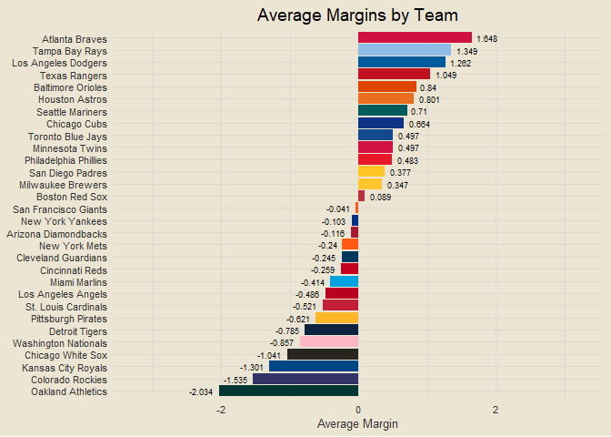
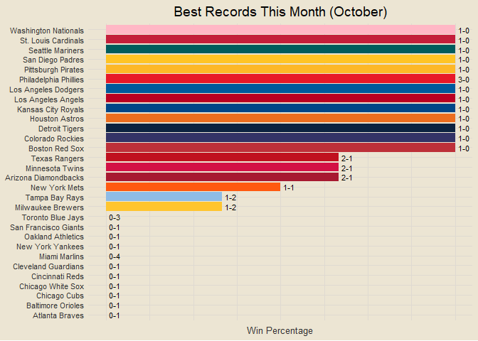
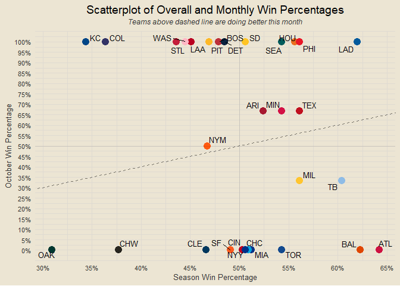
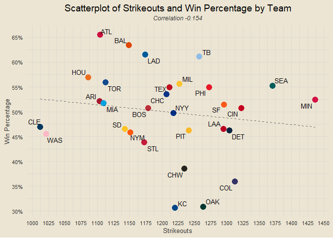

------------------------------------------------------------------------

**Data: MLB.com via {baseballr}**

# Contents

- [Team Rankings](#team-rankings)
- [Runs Scored v Runs Allowed](#runs-scored-v-runs-allowed)
- [Composite Performance Rating (CPR)
  Rankings](#composite-performance-rating-cpr-rankings)
- [Records x CPR Ranks](#records-x-cpr-ranks)
- [Scorigami (2023 Only)](#scorigami-2023-only)
- [Historic MLB Scorigami (Since
  1901)](#historic-mlb-scorigami-since-1901)
- [Top Team Analysis](#top-team-analysis)
- [Team Margins Plot](#team-margins-plot)
- [Scatterplot of Margins of Victory and
  Defeat](#scatterplot-of-margins-of-victory-and-defeat)
- [Margins of Victory and Defeat](#margins-of-victory-and-defeat)
- [One-Run Games](#one-run-games)
- [Yesterday’s Highest-Scoring Game](#yesterdays-highest-scoring-game)
- [Best Records This Month](#best-records-this-month)
- [Runs Scored v Runs Allowed This
  Month](#runs-scored-v-runs-allowed-this-month)
- [Sudden Death Records](#sudden-death-records)
- [Eras Records](#eras-records)
- [First Inning Runs Scored v
  Allowed](#first-inning-runs-scored-v-allowed)
- [First Inning Runs Scored v Allowed
  Rates](#first-inning-runs-scored-v-allowed-rates)
- [First Inning Scoring](#first-inning-scoring)
- [Home and Away Performance](#home-and-away-performance)
- [Monthly v Season Win Percentages](#monthly-v-season-win-percentages)
- [Win Percentage v Run Differential as Percent of Runs
  Scored](#win-percentage-v-run-differential-as-percent-of-runs-scored)
- [Win Percentage by Home Runs](#win-percentage-by-home-runs)

### Team Rankings

<!-- -->

### Runs Scored v Runs Allowed

<!-- -->

### Composite Performance Rating (CPR) Rankings

<!-- -->

### Records x CPR Ranks

<!-- -->

### Scorigami (2023 Only)

<!-- -->

### Historic MLB Scorigami (Since 1901)

<!-- -->

### Top Team Analysis

<!-- -->

### Team Margins Plot

<!-- -->

### Scatterplot of Margins of Victory and Defeat

<!-- -->

### Margins of Victory and Defeat

<!-- -->

### One-Run Games

<!-- -->

### Yesterday’s Highest-Scoring Game

<!-- -->

### Best Records This Month

<!-- -->

### Runs Scored v Runs Allowed This Month

<!-- -->

### Sudden Death Records

<!-- -->

### Eras Records

<!-- -->

### First Inning Runs Scored v Allowed

<!-- -->

### First Inning Runs Scored v Allowed Rates

<!-- -->

### First Inning Scoring

<!-- -->

### Home and Away Performance

<!-- -->

### Monthly v Season Win Percentages

<!-- -->

### Win Percentage v Run Differential as Percent of Runs Scored

<!-- -->

``` r
# runs scored in wins and losses + runs allowed in wins and losses
end_wl = end_games |>
  mutate(win_team = ifelse(home_score > away_score, home_team, away_team),
         win_score = ifelse(home_score > away_score, home_score, away_score),
         lose_team = ifelse(home_score > away_score, away_team, home_team),
         lose_score = ifelse(home_score > away_score, away_score, home_score))

# function to find games played
get_games_played = function(team) {
  return(end_wl |>
    filter(home_team == team | away_team == team) |>
    nrow())
}

# function to find runs scored in wins
get_win_scored = function(team) {
  return(end_wl |>
    filter(win_team == team) |>
    pull(win_score) |>
    sum() / get_games_played(team))
}

# function to find runs allowed in wins
get_win_allowed = function(team) {
  return(end_wl |>
    filter(win_team == team) |>
    pull(lose_score) |>
    sum() / get_games_played(team))
}

# function to find runs scored in losses
get_loss_scored = function(team) {
  return(end_wl |>
    filter(lose_team == team) |>
    pull(lose_score) |>
    sum() / get_games_played(team))
}

# function to find runs allowed in losses
get_loss_allowed = function(team) {
  return(end_wl |>
    filter(lose_team == team) |>
    pull(win_score) |>
    sum() / get_games_played(team))
}

wl_sa = data.frame(team = all_teams) |>
  mutate(win_scored = sapply(team, get_win_scored),
         win_allowed = sapply(team, get_win_allowed),
         loss_scored = sapply(team, get_loss_scored),
         loss_allowed = sapply(team, get_loss_allowed)) |>
  mutate_if(is.numeric, ~round(., 3))

wl_sa |>
  inner_join(team_abbrevs, by = "team") |>
  ggplot(aes(win_scored, loss_scored)) +
  geom_point(aes(col = team), size = 4, show.legend = F) +
  ggrepel::geom_text_repel(aes(label = abb), size = 3.5) +
  geom_line(stat = "smooth", formula = y ~ x, method = "lm", linetype = "dashed", alpha = 0.5) +
  scale_color_manual(values = team_color_codes) +
  labs(x = "Avg. Runs Scored in Wins", y = "Avg. Runs Scored in Losses",
       title = "Scatterplot of Runs Scored in Wins v. Losses",
       subtitle = "Teams above dashed line are scoring above-average runs in losses") +
  scale_x_continuous(breaks = seq(0, 10, by = 0.25)) +
  scale_y_continuous(breaks = seq(0, 5, by = 0.25))
```

<!-- -->

### Win Percentage by Home Runs

<!-- -->

### Win Percentage by Number of Strikeouts

*in progress*

``` r
all_ks = read_csv("all_game_ks.csv", col_types = cols())
# all_ks = data.frame(game_pk = NULL, team = NULL, ks = NULL)

get_game_ks = function(pk) {
  return(mlb_pbp(pk) |>
    filter(result.event == "Strikeout" & details.isOut) |>
    group_by(game_pk, team = batting_team) |>
    summarise(ks = n(),
              .groups = "drop"))
}

pk_list = all_game_pks |>
  filter(date < Sys.Date() & !game_pk %in% bad_pks & !game_pk %in% all_ks$game_pk) |>
  pull(game_pk)

if (length(pk_list) > 0) {
  for (i in 1:length(pk_list)) {
    ks = get_game_ks(pk_list[i])
    if (nrow(ks) == 0) ks = data.frame(game_pk = pk_list[i], team = "Chicago Cubs", ks = 0)
    all_ks = rbind(all_ks, ks)
    if (i %% 25 == 0) print(i)
  }
}

write_csv(all_ks, "all_game_ks.csv")

all_ks |>
  group_by(team) |>
  summarise(ks = sum(ks)) |>
  inner_join(all_homers |>
  group_by(team) |>
  summarise(hrs = sum(hrs)), by = "team") |>
  ggplot(aes(hrs, ks)) +
  geom_point(size = 4) +
  geom_line(stat = "smooth", formula = y ~ x, method = "lm", linetype = "dashed", alpha = 0.5)
```

<!-- -->

# DOING THIS FOR EVERY TEAM MIGHT BE INTERESTING

``` r
braves_homers = all_homers |>
  filter(team == "Atlanta Braves") |>
  select(-team)

win_homers = all_game_pks |>
  inner_join(end_games, by = c("date", "away_team", "home_team")) |>
  mutate(win_team = ifelse(home_score > away_score, home_team, away_team),
         lose_team = ifelse(home_score > away_score, away_team, home_team)) |>
  filter(win_team == "Atlanta Braves") |>
  left_join(braves_homers, by = "game_pk") |>
  summarise(homers = sum(hrs, na.rm = T),
            n = n())

loss_homers = all_game_pks |>
  inner_join(end_games, by = c("date", "away_team", "home_team")) |>
  mutate(win_team = ifelse(home_score > away_score, home_team, away_team),
         lose_team = ifelse(home_score > away_score, away_team, home_team)) |>
  filter(lose_team == "Atlanta Braves") |>
  left_join(braves_homers, by = "game_pk") |>
  summarise(homers = sum(hrs, na.rm = T),
            n = n())

paste0("atlanta braves")
```

    ## [1] "atlanta braves"

``` r
paste0("average # of HRs in wins: ", round(win_homers$homers / win_homers$n, 3))
```

    ## [1] "average # of HRs in wins: 2.218"

``` r
paste0("average # of HRs in losses: ", round(loss_homers$homers / loss_homers$n, 3))
```

    ## [1] "average # of HRs in losses: 1.184"
