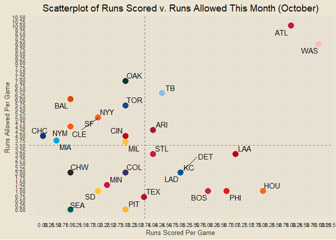
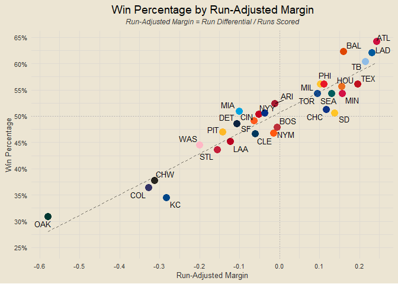
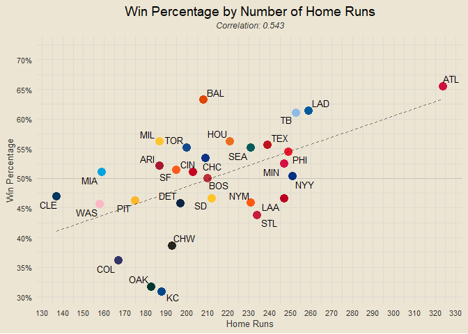
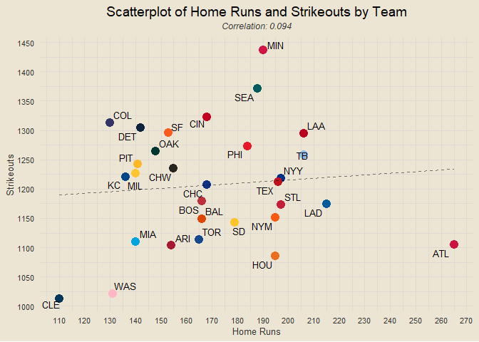
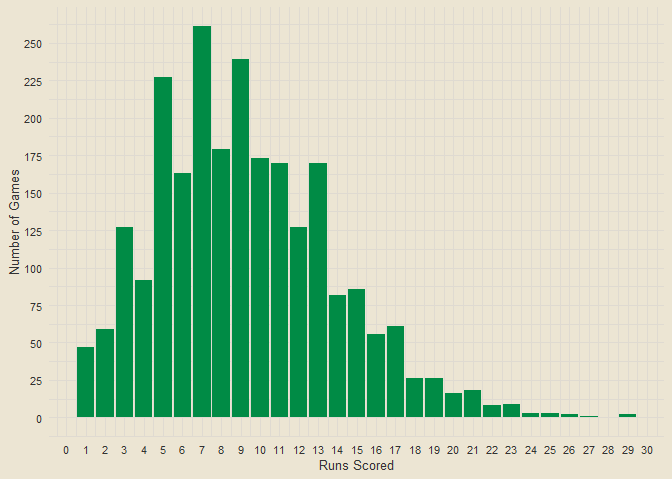
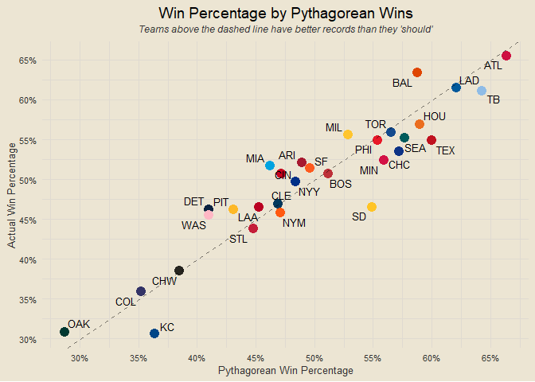

------------------------------------------------------------------------

**Data: MLB.com via {baseballr}**

------------------------------------------------------------------------

# Contents

- [Team Rankings](#team-rankings)
- [Runs Scored v Runs Allowed](#runs-scored-v-runs-allowed)
- [Composite Performance Rating (CPR)
  Rankings](#composite-performance-rating-cpr-rankings)
- [Records x CPR Ranks](#records-x-cpr-ranks)
- [Scorigami (2023 Only)](#scorigami-2023-only)
- [Historic MLB Scorigami (Since
  1901)](#historic-mlb-scorigami-since-1901)
- [Top Team Analysis](#top-team-analysis)
- [Team Margins Plot](#team-margins-plot)
- [Scatterplot of Margins of Victory and
  Defeat](#scatterplot-of-margins-of-victory-and-defeat)
- [Margins of Victory and Defeat](#margins-of-victory-and-defeat)
- [One-Run Games](#one-run-games)
- [Yesterday’s Highest-Scoring Game](#yesterdays-highest-scoring-game)
- [Best Records This Month](#best-records-this-month)
- [Runs Scored v Runs Allowed This
  Month](#runs-scored-v-runs-allowed-this-month)
- [Sudden Death Records](#sudden-death-records)
- [Eras Records](#eras-records)
- [First Inning Runs Scored v
  Allowed](#first-inning-runs-scored-v-allowed)
- [First Inning Runs Scored v Allowed
  Rates](#first-inning-runs-scored-v-allowed-rates)
- [First Inning Scoring](#first-inning-scoring)
- [Home and Away Performance](#home-and-away-performance)
- [Monthly v Season Win Percentages](#monthly-v-season-win-percentages)
- [Win Percentage v Run Differential as Percent of Runs
  Scored](#win-percentage-v-run-differential-as-percent-of-runs-scored)
- [Runs Scored in Wins and Losses](#runs-scored-in-wins-and-losses)
- [Win Percentage by Home Runs](#win-percentage-by-home-runs)
- [Win Percentage by Strikeouts](#win-percentage-by-strikeouts)
- [Home Runs by Strikeouts](#home-runs-by-strikeouts)
- [Home Runs in Wins and Losses](#home-runs-in-wins-and-losses)
- [When are teams scoring?](#when-are-teams-scoring)

### Team Rankings

<!-- -->

### Runs Scored v Runs Allowed

<!-- -->

### Composite Performance Rating (CPR) Rankings

<!-- -->

### Records x CPR Ranks

<!-- -->

### Scorigami (2023 Only)

<!-- -->

### Historic MLB Scorigami (Since 1901)

<!-- -->

### Top Team Analysis

<!-- -->

### Team Margins Plot

<!-- -->

### Scatterplot of Margins of Victory and Defeat

<!-- -->

### Margins of Victory and Defeat

<!-- -->

### One-Run Games

<!-- -->

### Yesterday’s Highest-Scoring Game

<!-- -->

### Best Records This Month

<!-- -->

### Runs Scored v Runs Allowed This Month

<!-- -->

### Sudden Death Records

<!-- -->

### Eras Records

<!-- -->

### First Inning Runs Scored v Allowed

<!-- -->

### First Inning Runs Scored v Allowed Rates

<!-- -->

### First Inning Scoring

<!-- -->

### Home and Away Performance

<!-- -->

### Monthly v Season Win Percentages

<!-- -->

### Win Percentage v Run Differential as Percent of Runs Scored

<!-- -->

### Runs Scored in Wins and Losses

<!-- -->

### Win Percentage by Home Runs

<!-- -->

### Win Percentage by Strikeouts

<!-- -->

### Home Runs by Strikeouts

<!-- -->

### Home Runs in Wins and Losses

<!-- -->

### When are teams scoring?

<!-- -->

### Which teams play the closest games?

<!-- -->

### Pythagorean Wins

``` r
get_pythag_wins = function(team) {
  home_scored = end_games |> filter(home_team == team) |> pull(home_score)
  away_scored = end_games |> filter(away_team == team) |> pull(away_score)
  home_allow = end_games |> filter(home_team == team) |> pull(away_score)
  away_allow = end_games |> filter(away_team == team) |> pull(home_score)
  scored = sum(home_scored) + sum(away_scored)
  allowed = sum(home_allow) + sum(away_allow)
  x = scored ^ 2 / (scored ^ 2 + allowed ^ 2)
  return(round(x, 3))
}

team_records |>
  select(team, win_pct) |>
  mutate(py_wins = sapply(team, get_pythag_wins)) |>
  inner_join(team_abbrevs, by = "team") |>
  ggplot(aes(py_wins, win_pct)) +
  geom_point(aes(col = team), size = 4, show.legend = F) +
  scale_color_manual(values = team_color_codes) +
  geom_abline(linetype = "dashed", alpha = 0.5) +
  ggrepel::geom_text_repel(aes(label = abb), size = 3.5) +
  labs(x = "Pythagorean Win Percentage", y = "Actual Win Percentage",
       title = "Win Percentage by Pythagorean Wins",
       subtitle = "Teams above the dashed line have better records than they 'should'") +
  scale_x_continuous(breaks = seq(0, 1, by = 0.05), labels = scales::percent) +
  scale_y_continuous(breaks = seq(0, 1, by = 0.05), labels = scales::percent)
```

<!-- -->

``` r
# team_records |>
#   select(team, win_pct) |>
#   mutate(py_wins = sapply(team, get_pythag_wins),
#          diff = py_wins - win_pct) |>
#   arrange(desc(diff))
```
