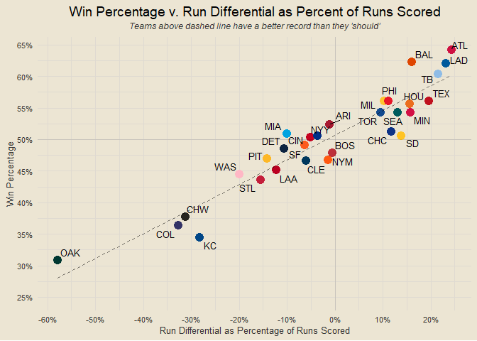

# Contents

- [Team Rankings](#team-rankings)
- [Runs Scored v Runs Allowed](#runs-scored-v-runs-allowed)
- [Composite Performance Rating (CPR)
  Rankings](#composite-performance-rating-cpr-rankings)
- [Records x CPR Ranks](#records-x-cpr-ranks)
- [Scorigami (2023 Only)](#scorigami-2023-only)
- [Historic MLB Scorigami (Since
  1901)](#historic-mlb-scorigami-since-1901)
- [Top Team Analysis](#top-team-analysis)
- [Team Margins Plot](#team-margins-plot)
- [Scatterplot of Margins of Victory and
  Defeat](#scatterplot-of-margins-of-victory-and-defeat)
- [Margins of Victory and Defeat](#margins-of-victory-and-defeat)
- [One-Run Games](#one-run-games)
- [Yesterday’s Highest-Scoring Game](#yesterdays-highest-scoring-game)
- [Best Records This Month](#best-records-this-month)
- [Runs Scored This Month](#runs-scored-this-month)
- [Runs Allowed This Month](#runs-allowed-this-month)
- [Best Home Records](#best-home-records)
- [Best Away Records](#best-away-records)
- [Runs Scored v Runs Allowed This
  Month](#runs-scored-v-runs-allowed-this-month)

### Team Rankings

<!-- -->

### Runs Scored v Runs Allowed

<!-- -->

### Composite Performance Rating (CPR) Rankings

<!-- -->

### Records x CPR Ranks

<!-- -->

### Scorigami (2023 Only)

<!-- -->

### Historic MLB Scorigami (Since 1901)

<!-- -->

### Top Team Analysis

<!-- -->

### Team Margins Plot

<!-- -->

### Scatterplot of Margins of Victory and Defeat

<!-- -->

### Margins of Victory and Defeat

<!-- -->

### One-Run Games

<!-- -->

### Yesterday’s Highest-Scoring Game

<!-- -->

### Best Records This Month

<!-- -->

### Runs Scored This Month

<!-- -->

### Runs Allowed This Month

<!-- -->

### Best Home Records

<!-- -->

### Best Away Records

<!-- -->

### Runs Scored v Runs Allowed This Month

<!-- -->

<!-- ### what if hits won games? -->

``` r
end_with_pks = end_games |> left_join(all_game_pks, by = c("date", "home_team", "away_team"))
hit_criteria = c("Single", "Double", "Triple", "Home Run")

get_pk_hits = function(fpk) {
  f_data = mlb_pbp(fpk) |> filter(details.isInPlay == T & result.event %in% hit_criteria)
  home_team = unique(f_data$home_team)
  return(f_data |> mutate(is_hit = 1) |> group_by(batting_team) |> summarise(n_hits = sum(is_hit)) |>
    mutate(batting_team = ifelse(batting_team == home_team, "home_hits", "away_hits")) |>
    pivot_wider(names_from = "batting_team", values_from = "n_hits") |>
    transmute(game_pk = fpk, home_hits, away_hits))
}

bind_pk_set = data.frame(game_pk = NULL, home_hits = NULL, away_hits = NULL)
bad_pks = c(718700, 718558, 718371)

for (i in 1:length(all_game_pks$game_pk)) {
  if (all_game_pks$game_pk[i] %in% bad_pks) {
    print("bad pk")
    f_data = data.frame(game_pk = all_game_pks$game_pk[i], home_hits = NA, away_hits = NA)
  } else {
  f_data = get_pk_hits(all_game_pks$game_pk[i])
  }
  bind_pk_set = rbind(bind_pk_set, f_data)
  if (i %% 5 == 0) print(i)
}

bind_pk_set
```
