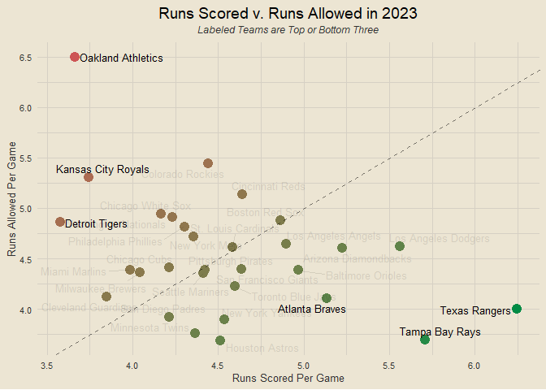

mlb cpr
================

# *this is very much a work in progress*

### setup

``` r
library(tidyverse)
library(tidymodels)
library(tvthemes)
library(janitor)
library(patchwork)
library(baseballr)

theme_custom = theme_avatar() +
  theme(plot.title = element_text(hjust = 0.5),
        panel.grid.major = element_line(linewidth = 0.5, colour = "#D6D0C4"),
        panel.grid.minor = element_line(linewidth = 0.5, colour = "#D6D0C4"))

theme_set(theme_custom)
```

### data import

``` r
loop_dates = seq.Date(from = as_date("2023-03-30"), to = Sys.Date() - 1, by = 1)
end_games = data.frame(date = NULL, away_team = NULL, away_score = NULL, home_score = NULL, home_team = NULL)

for (i in 1:length(loop_dates)) {
  loop_df = mlb_game_pks(date = loop_dates[i]) |>
    mutate(date = loop_dates[i]) |>
    select(date, away_team = teams.away.team.name, away_score = teams.away.score,
           home_score = teams.home.score, home_team = teams.home.team.name)
  
  end_games = rbind(end_games, loop_df)
}

end_games = na.omit(end_games)
```

``` r
all_teams = sort(unique(end_games$home_team))

get_team_rspg = function(team) {
  home_scores = end_games |> filter(home_team == team) |> pull(home_score)
  away_scores = end_games |> filter(away_team == team) |> pull(away_score)
  return(round(mean(c(home_scores, away_scores)), 3))
}

get_team_rapg = function(team) {
  home_scores = end_games |> filter(home_team == team) |> pull(away_score)
  away_scores = end_games |> filter(away_team == team) |> pull(home_score)
  return(round(mean(c(home_scores, away_scores)), 3))
}

rpg_df = data.frame(team = all_teams) |>
  mutate(rspg = sapply(team, get_team_rspg),
         rapg = sapply(team, get_team_rapg))
```

``` r
rpg_df |>
  mutate(diff = rspg - rapg) |>
  ggplot(aes(rspg, rapg)) +
  geom_point() +
  geom_abline() +
  annotate("text", x = 6.5, y = 4, label = "these teams are\nreally good") +
  annotate("text", x = 5, y = 7, label = "these teams \nkinda suck")
```

<!-- -->

``` r
end_extended = end_games |>
  left_join(rpg_df, by = c("home_team" = "team")) |>
  rename(home_rspg = rspg, home_rapg = rapg) |>
  left_join(rpg_df, by = c("away_team" = "team")) |>
  rename(away_rspg = rspg, away_rapg = rapg) |>
  mutate(home_exp = round((home_rspg + away_rapg) / 2, 3),
         away_exp = round((away_rspg + home_rapg) / 2, 3),
         home_off_cpr = home_score - home_exp,
         home_def_cpr = away_exp - away_score,
         away_off_cpr = away_score - away_exp,
         away_def_cpr = home_exp - home_score)
```

``` r
end_extended
```

    ##            date            away_team away_score home_score            home_team
    ##   1: 2023-03-30       Atlanta Braves          7          2 Washington Nationals
    ##   2: 2023-03-30 San Francisco Giants          0          5     New York Yankees
    ##   3: 2023-03-30    Baltimore Orioles         10          9       Boston Red Sox
    ##   4: 2023-03-30    Milwaukee Brewers          0          4         Chicago Cubs
    ##   5: 2023-03-30       Detroit Tigers          0          4       Tampa Bay Rays
    ##  ---                                                                           
    ## 232: 2023-04-16        New York Mets          4          3    Oakland Athletics
    ## 233: 2023-04-16         Chicago Cubs          3          2  Los Angeles Dodgers
    ## 234: 2023-04-16     Colorado Rockies          0          1     Seattle Mariners
    ## 235: 2023-04-16    Milwaukee Brewers          1          0     San Diego Padres
    ## 236: 2023-04-16        Texas Rangers          9          1       Houston Astros
    ##      home_rspg home_rapg away_rspg away_rapg home_exp away_exp home_off_cpr
    ##   1:     3.875     5.125     5.438     3.938    3.907    5.281       -1.907
    ##   2:     4.625     3.062     4.929     5.357    4.991    3.995        0.009
    ##   3:     5.438     5.250     5.875     5.438    5.438    5.562        3.562
    ##   4:     5.214     4.071     4.812     3.062    4.138    4.441       -0.138
    ##   5:     7.125     2.625     3.571     6.214    6.670    3.098       -2.670
    ##  ---                                                                       
    ## 232:     3.875     7.812     4.688     3.938    3.907    6.250       -0.907
    ## 233:     5.312     4.188     5.214     4.071    4.691    4.701       -2.691
    ## 234:     4.625     4.125     3.938     5.625    5.125    4.032       -4.125
    ## 235:     4.176     4.294     4.812     3.062    3.619    4.553       -3.619
    ## 236:     4.812     4.375     5.600     4.267    4.540    4.987       -3.540
    ##      home_def_cpr away_off_cpr away_def_cpr
    ##   1:       -1.719        1.719        1.907
    ##   2:        3.995       -3.995       -0.009
    ##   3:       -4.438        4.438       -3.562
    ##   4:        4.441       -4.441        0.138
    ##   5:        3.098       -3.098        2.670
    ##  ---                                       
    ## 232:        2.250       -2.250        0.907
    ## 233:        1.701       -1.701        2.691
    ## 234:        4.032       -4.032        4.125
    ## 235:        3.553       -3.553        3.619
    ## 236:       -4.013        4.013        3.540

### MLB SCORIGAMI?
