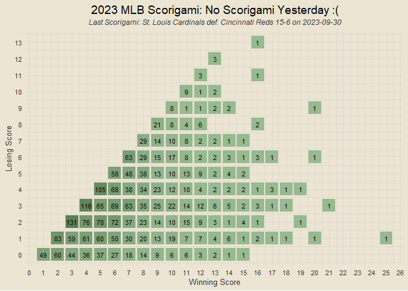
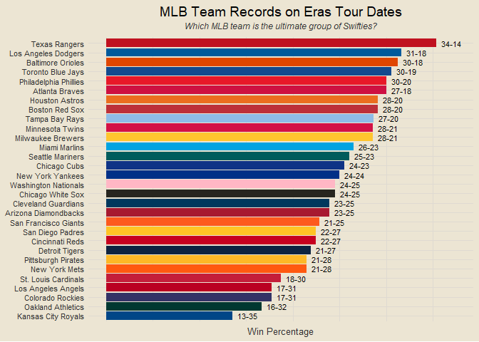

------------------------------------------------------------------------

**Data: MLB.com via {baseballr}**

# Contents

- [Team Rankings](#team-rankings)
- [Runs Scored v Runs Allowed](#runs-scored-v-runs-allowed)
- [Composite Performance Rating (CPR)
  Rankings](#composite-performance-rating-cpr-rankings)
- [Records x CPR Ranks](#records-x-cpr-ranks)
- [Scorigami (2023 Only)](#scorigami-2023-only)
- [Historic MLB Scorigami (Since
  1901)](#historic-mlb-scorigami-since-1901)
- [Top Team Analysis](#top-team-analysis)
- [Team Margins Plot](#team-margins-plot)
- [Scatterplot of Margins of Victory and
  Defeat](#scatterplot-of-margins-of-victory-and-defeat)
- [Margins of Victory and Defeat](#margins-of-victory-and-defeat)
- [One-Run Games](#one-run-games)
- [Yesterday’s Highest-Scoring Game](#yesterdays-highest-scoring-game)
- [Best Records This Month](#best-records-this-month)
- [Runs Scored This Month](#runs-scored-this-month)
- [Runs Allowed This Month](#runs-allowed-this-month)
- [Best Home Records](#best-home-records)
- [Best Away Records](#best-away-records)
- [Runs Scored v Runs Allowed This
  Month](#runs-scored-v-runs-allowed-this-month)
- [What if Games Were Decided by
  Hits?](#what-if-games-were-decided-by-hits)
- [What if Games Were Decided by Total
  Bases?](#what-if-games-were-decided-by-total-bases)
- [Eras Records](#eras-records)

### Team Rankings

<!-- -->

### Runs Scored v Runs Allowed

<!-- -->

### Composite Performance Rating (CPR) Rankings

<!-- -->

### Records x CPR Ranks

<!-- -->

### Scorigami (2023 Only)

<!-- -->

### Historic MLB Scorigami (Since 1901)

<!-- -->

### Top Team Analysis

<!-- -->

### Team Margins Plot

<!-- -->

### Scatterplot of Margins of Victory and Defeat

<!-- -->

### Margins of Victory and Defeat

<!-- -->

### One-Run Games

<!-- -->

### Yesterday’s Highest-Scoring Game

<!-- -->

### Best Records This Month

<!-- -->

### Runs Scored This Month

<!-- -->

### Runs Allowed This Month

<!-- -->

### Best Home Records

<!-- -->

### Best Away Records

<!-- -->

### Runs Scored v Runs Allowed This Month

<!-- -->

### What if Games Were Decided by Hits?

### What if Games Were Decided by Total Bases?

``` r
pk_total_bases = function(fpk) {
  f_data = mlb_pbp(fpk) |>
    filter(details.isInPlay == T & result.event %in% c("Single", "Double", "Triple", "Home Run", "Walk"))
  
  home_team = unique(f_data$home_team)
  
  return(f_data |>
    mutate(total_bases = case_when(result.event == "Single" ~ 1,
                                   result.event == "Double" ~ 2,
                                   result.event == "Triple" ~ 3,
                                   result.event == "Home Run" ~ 4)) |>
    group_by(batting_team) |>
    summarise(total_bases = sum(total_bases)) |>
    mutate(batting_team = ifelse(batting_team == home_team, "home_bases", "away_bases")) |>
    pivot_wider(names_from = "batting_team", values_from = "total_bases") |>
    transmute(game_pk = fpk, home_bases, away_bases))
}

pk_list = all_game_pks$game_pk
# bases_df = data.frame(game_pk = NULL, home_bases = NULL, away_bases = NULL)
# 
# for (i in 1:length(pk_list)) {
#   if (pk_list[i] %in% bad_pks) {
#     loop_data = data.frame(game_pk = fpk, home_bases = NA, away_bases = NA)
#   } else {
#     loop_data = pk_total_bases(pk_list[i])
#   }
#   bases_df = rbind(bases_df, loop_data)
#   if (i %% 25 == 0) print(paste0(i, " of ", length(pk_list)))
# }

bases_df = read_csv("bases_8july2023.csv", col_types = cols())

bases_wl = all_game_pks |>
  left_join(bases_df, by = "game_pk") |>
  filter(!is.na(home_bases) & !is.na(away_bases)) |>
  mutate(bases_winner = case_when(home_bases > away_bases ~ home_team,
                                  home_bases < away_bases ~ away_team,
                                  home_bases == away_bases ~ "Tie"),
         bases_loser = case_when(home_bases > away_bases ~ away_team,
                                  home_bases < away_bases ~ home_team,
                                  home_bases == away_bases ~ "Tie"))

bases_ties = bases_wl |> filter(bases_winner == "Tie")
bases_nontie = bases_wl |> filter(bases_winner != "Tie")

bases_records = bases_nontie |>
  count(bases_winner) |>
  rename(team = bases_winner, wins = n) |>
  left_join(bases_nontie |>
  count(bases_loser) |>
  rename(team = bases_loser, losses = n), by = "team") |>
  left_join(bases_ties |>
  count(home_team) |>
  rename(team = home_team, home_ties = n), by = "team") |>
  left_join(bases_ties |>
  count(away_team) |>
  rename(team = away_team, away_ties = n), by = "team") |>
  mutate(home_ties = replace_na(home_ties, 0),
         away_ties = replace_na(away_ties, 0)) |>
  transmute(team, wins, losses, ties = home_ties + away_ties) |>
  mutate(win_pct = round(wins / (wins + losses), 3),
         record = paste0(wins, "-", losses, "-", ties))

# bases_records |>
#   ggplot(aes(reorder(team, win_pct), win_pct)) +
#   geom_col(aes(fill = team), show.legend = F) +
#   geom_text(aes(label = record), size = 3, hjust = -0.25) +
#   scale_fill_manual(values = team_color_codes) +
#   coord_flip(ylim = c(0, 0.8)) +
#   labs(x = NULL, y = "Win Percentage",
#        title = "Team Records if Games Were Decided by Total Bases",
#        caption = "Data as of 8 July 2023") +
#   theme(axis.text.x = element_blank())

bases_records |>
  select(team, b_win_pct = win_pct) |>
  left_join(team_records, by = "team") |>
  left_join(team_abbrevs, by = "team") |>
  ggplot(aes(win_pct, b_win_pct)) +
  geom_point(aes(col = abb), show.legend = F, size = 4) +
  ggrepel::geom_text_repel(aes(label = abb), size = 4) +
  scale_color_manual(values = team_color_codes) +
  geom_abline(linetype = "dashed", alpha = 0.5) +
  scale_x_continuous(breaks = seq(0, 1, by = 0.05)) +
  scale_y_continuous(breaks = seq(0, 1, by = 0.05)) +
  labs(x = "Win Percentage", y = "Win Percentage if Wins Determined by Total Bases",
       title = "What if game outcomes were decided by total bases instead of runs?",
       subtitle = "Teams above dashed line would benefit",
       caption = "Total Bases Data as of 8 July 2023")
```

<!-- -->

<!-- --><!-- -->

### Eras Records

<!-- -->
