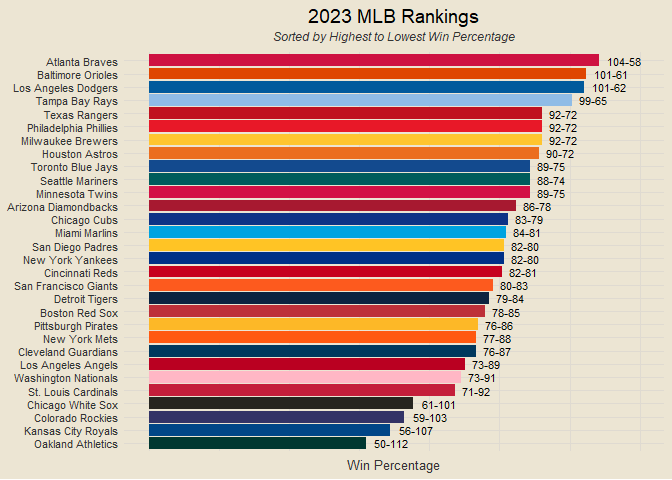
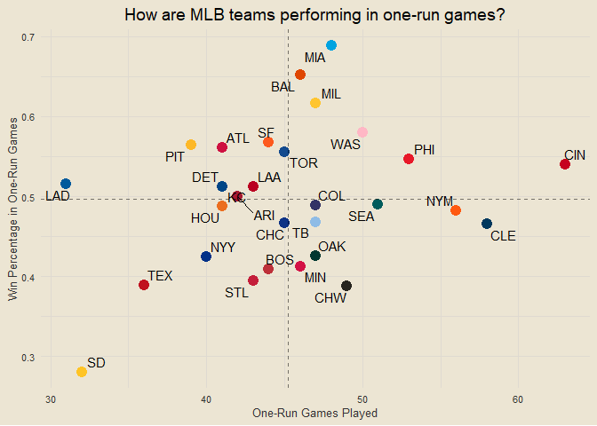
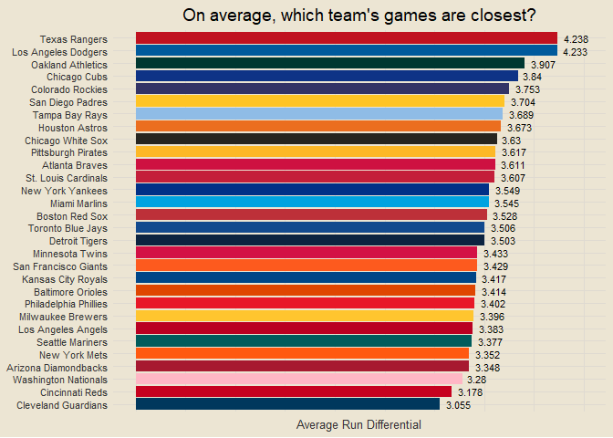
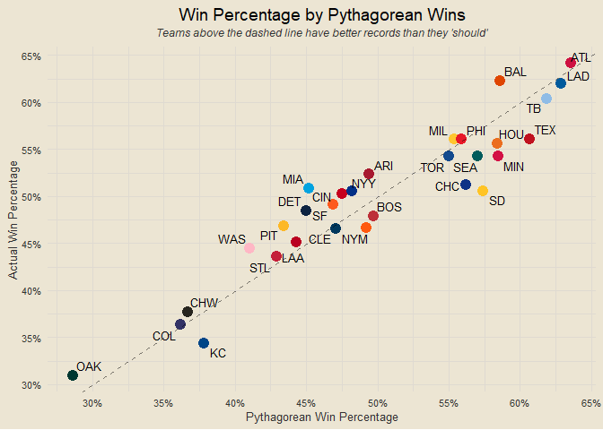
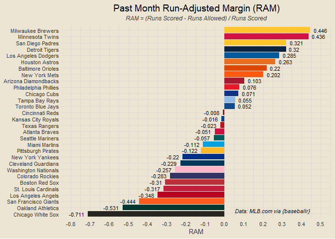

------------------------------------------------------------------------

**Data: MLB.com via {baseballr}** \| Last Updated: September 15, 2023 at
09:08:36

------------------------------------------------------------------------

# Contents

- [Team Rankings](#team-rankings)
- [Runs Scored v Runs Allowed](#runs-scored-v-runs-allowed)
- [Composite Performance Rating (CPR)
  Rankings](#composite-performance-rating-cpr-rankings)
- [Scorigami (2023 Only)](#scorigami-2023-only)
- [Historic MLB Scorigami (Since
  1901)](#historic-mlb-scorigami-since-1901)
- [Top Team Analysis](#top-team-analysis)
- [Team Margins Plot](#team-margins-plot)
- [Scatterplot of Margins of Victory and
  Defeat](#scatterplot-of-margins-of-victory-and-defeat)
- [Margins of Victory and Defeat](#margins-of-victory-and-defeat)
- [One-Run Games](#one-run-games)
- [Best Records This Month](#best-records-this-month)
- [Runs Scored v Runs Allowed This
  Month](#runs-scored-v-runs-allowed-this-month)
- [Eras Records](#eras-records)
- [Home and Away Performance](#home-and-away-performance)
- [Monthly v Season Win Percentages](#monthly-v-season-win-percentages)
- [Win Percentage v Run Differential as Percent of Runs
  Scored](#win-percentage-v-run-differential-as-percent-of-runs-scored)
- [Pythagorean Wins](#pythagorean-wins)
- [Close Games](#close-games)

### Team Rankings

<!-- -->

### Runs Scored v Runs Allowed

<!-- -->

### Composite Performance Rating (CPR) Rankings

<!-- -->

### Scorigami (2023 Only)

<!-- -->

### Historic MLB Scorigami (Since 1901)

<!-- -->

### Top Team Analysis

<!-- -->

### Team Margins Plot

<!-- -->

### Scatterplot of Margins of Victory and Defeat

<!-- -->

### Margins of Victory and Defeat

<!-- -->

### One-Run Games

<!-- -->

### Best Records This Month

<!-- -->

### Runs Scored v Runs Allowed This Month

<!-- -->

### Eras Records

<!-- -->

### Home and Away Performance

<!-- -->

### Monthly v Season Win Percentages

<!-- -->

### Win Percentage v Run Differential as Percent of Runs Scored

<!-- -->

### Which teams play the closest games?

<!-- -->

### Pythagorean Wins

<!-- -->

    ## [1] "Run-adjusted margin is more correlated than pythagorean wins (0.932 vs. 0.93)"

<!-- -->

### Close Games

<!-- -->

### Monthly Win Trends

<!-- -->

### Monthly Scoring Trends

<!-- -->

### Best Team of Past Month?

``` r
# getting vector of all team names
all_teams = mlb_teams(season = 2023) |>
  filter(sport_name == "Major League Baseball") |>
  pull(team_full_name) |>
  sort()

# getting end game data and adding info
end_games = mlb_schedule(season = 2023, level_ids = "1") |>
  filter(teams_away_team_name %in% all_teams &
           teams_home_team_name %in% all_teams &
           series_description == "Regular Season" &
           status_detailed_state == "Final") |>
  select(date, game_pk,
         away_team = teams_away_team_name, away_score = teams_away_score,
         home_score = teams_home_score, home_team = teams_home_team_name) |>
  mutate(date = as_date(date),
         win_team = ifelse(home_score > away_score, home_team, away_team),
         win_score = ifelse(home_score > away_score, home_score, away_score),
         lose_score = ifelse(home_score > away_score, away_score, home_score),
         lose_team = ifelse(home_score > away_score, away_team, home_team),
         final_score = paste0(win_score, "-", lose_score),
         description = paste0(win_team, " def. ", lose_team, " ", final_score))

# best records of the past month
# end_games |>
#   filter(date >= Sys.Date() - 31) |>
#   count(win_team) |>
#   rename(team = win_team, wins = n) |>
#   inner_join(end_games |>
#   filter(date >= Sys.Date() - 31) |>
#   count(lose_team) |>
#   rename(team = lose_team, losses = n), by = "team") |>
#   mutate(win_pct = round(wins / (wins + losses), 3)) |>
#   arrange(desc(win_pct))

# function to get runs scored in past month
get_past_month_runs_scored = function(team) {
  home_runs = end_games |> filter(date >= Sys.Date() - 31 & home_team == team) |> pull(home_score) |> sum()
  away_runs = end_games |> filter(date >= Sys.Date() - 31 & away_team == team) |> pull(away_score) |> sum()
  return(home_runs + away_runs)
}

# function to get runs allowed in past month
get_past_month_runs_allowed = function(team) {
  home_runs = end_games |> filter(date >= Sys.Date() - 31 & home_team == team) |> pull(away_score) |> sum()
  away_runs = end_games |> filter(date >= Sys.Date() - 31 & away_team == team) |> pull(home_score) |> sum()
  return(home_runs + away_runs)
}

# team color codes
team_color_codes = c("#A71930", "#CE1141", "#DF4601", "#BD3039", "#0E3386",
                     "#27251F", "#C6011F", "#00385D", "#333366", "#0C2340",
                     "#EB6E1F", "#004687", "#BA0021", "#005A9C", "#00A3E0",
                     "#FFC52F", "#D31145", "#FF5910", "#003087", "#003831",
                     "#E81828", "#FDB827", "#FFC425", "#FD5A1E", "#005C5C",
                     "#C41E3A", "#8FBCE6", "#C0111F", "#134A8E", "#FFB7C5")

# getting run-adjusted margins for each team in past month
past_month_ram = data.frame(team = all_teams) |>
  mutate(scored = sapply(team, get_past_month_runs_scored),
         allowed = sapply(team, get_past_month_runs_allowed),
         diff = scored - allowed,
         ram = round(diff / scored, 3),
         pos_lab = ifelse(ram >= 0, ram, ""),
         neg_lab = ifelse(ram < 0, ram, ""))

past_month_ram |>
  ggplot(aes(reorder(team, ram), ram)) +
  geom_col(aes(fill = team), show.legend = F) +
  geom_text(aes(label = pos_lab), size = 3, hjust = -0.25) +
  geom_text(aes(label = neg_lab), size = 3, hjust = 1.25) +
  annotate("text", x = 1.5, y = 0.25, label = "Data: MLB.com via {baseballr}", size = 3, fontface = "italic") +
  scale_fill_manual(values = team_color_codes) +
  scale_y_continuous(breaks = seq(-3, 3, by = 0.1)) +
  coord_flip(ylim = c(min(past_month_ram$ram) * 1.1, max(past_month_ram$ram) * 1.1)) +
  labs(x = NULL, y = "RAM",
       title = "Past Month Run-Adjusted Margin (RAM)",
       subtitle = "RAM = (Runs Scored - Runs Allowed) / Runs Scored")
```

<!-- -->

``` r
margin_results = end_games |>
  mutate(win_margin = win_score - lose_score,
         margin_description = paste0(win_team, " win by ", win_margin),
         loser_desc = paste0(lose_team, " lose by ", win_margin)) |>
  count(margin_description) |>
  mutate(desc = paste0(margin_description, " (", n, ")")) |>
  arrange(desc(n), margin_description) |>
  pull(desc)

margin_results_L = end_games |>
  mutate(win_margin = win_score - lose_score,
         margin_description = paste0(win_team, " win by ", win_margin),
         loser_desc = paste0(lose_team, " lose by ", win_margin)) |>
  count(loser_desc) |>
  mutate(desc = paste0(loser_desc, " (", n, ")")) |>
  arrange(desc(n), loser_desc) |>
  pull(desc)

upper_limit = 10

for (i in 1:upper_limit) {
  print(margin_results[i])
}
```

    ## [1] "Cincinnati Reds win by 1 (33)"
    ## [1] "Miami Marlins win by 1 (30)"
    ## [1] "Milwaukee Brewers win by 1 (27)"
    ## [1] "Baltimore Orioles win by 1 (26)"
    ## [1] "Washington Nationals win by 1 (25)"
    ## [1] "Cleveland Guardians win by 1 (24)"
    ## [1] "New York Mets win by 1 (23)"
    ## [1] "Philadelphia Phillies win by 1 (23)"
    ## [1] "Seattle Mariners win by 1 (23)"
    ## [1] "Toronto Blue Jays win by 1 (23)"

``` r
print("========================================")
```

    ## [1] "========================================"

``` r
for (i in 1:upper_limit) {
  print(margin_results_L[i])
}
```

    ## [1] "Cleveland Guardians lose by 1 (29)"
    ## [1] "Oakland Athletics lose by 1 (27)"
    ## [1] "Chicago White Sox lose by 1 (26)"
    ## [1] "Cincinnati Reds lose by 1 (26)"
    ## [1] "New York Mets lose by 1 (25)"
    ## [1] "Seattle Mariners lose by 1 (25)"
    ## [1] "St. Louis Cardinals lose by 1 (24)"
    ## [1] "Tampa Bay Rays lose by 1 (24)"
    ## [1] "Minnesota Twins lose by 1 (23)"
    ## [1] "Boston Red Sox lose by 1 (22)"

``` r
end_games |>
  mutate(diff = win_score - lose_score) |>
  filter(diff >= 3) |>
  count(win_team) |>
  arrange(desc(n)) |>
  rename(`Team` = win_team,
         `Wins by 3+` = n)
```

    ## # A tibble: 30 × 2
    ##    Team                `Wins by 3+`
    ##    <chr>                      <int>
    ##  1 Los Angeles Dodgers           64
    ##  2 Tampa Bay Rays                60
    ##  3 Atlanta Braves                57
    ##  4 Texas Rangers                 57
    ##  5 San Diego Padres              50
    ##  6 Baltimore Orioles             49
    ##  7 Chicago Cubs                  49
    ##  8 Houston Astros                48
    ##  9 Toronto Blue Jays             48
    ## 10 Boston Red Sox                44
    ## # ℹ 20 more rows

``` r
reg23 = end_games |>
  mutate(total_score = home_score + away_score)

post22 = mlb_schedule(season = 2022, level_ids = "1") |>
  filter(teams_away_team_name %in% all_teams &
           teams_home_team_name %in% all_teams &
           series_description %in% c("Division Series", "League Championship Series", "Wild Card Game", "World Series") &
           status_detailed_state == "Final") |>
  select(date, game_pk,
         away_team = teams_away_team_name, away_score = teams_away_score,
         home_score = teams_home_score, home_team = teams_home_team_name) |>
  mutate(date = as_date(date),
         win_team = ifelse(home_score > away_score, home_team, away_team),
         win_score = ifelse(home_score > away_score, home_score, away_score),
         lose_score = ifelse(home_score > away_score, away_score, home_score),
         lose_team = ifelse(home_score > away_score, away_team, home_team),
         final_score = paste0(win_score, "-", lose_score),
         description = paste0(win_team, " def. ", lose_team, " ", final_score),
         total_score = home_score + away_score)
```

``` r
# most postseason games had six or less runs scored
# post22 |>
#   count(total_score <= 6)

reg23 |>
  filter(total_score <= 6) |>
  count(win_team) |>
  rename(team = win_team, wins = n) |>
  inner_join(reg23 |>
  filter(total_score <= 6) |>
  count(lose_team) |>
  rename(team = lose_team, losses = n), by = "team") |>
  mutate(win_pct = round(wins / (wins + losses), 3)) |>
  arrange(desc(win_pct))
```

    ## # A tibble: 30 × 4
    ##    team                  wins losses win_pct
    ##    <chr>                <int>  <int>   <dbl>
    ##  1 Los Angeles Dodgers     24      8   0.75 
    ##  2 Atlanta Braves          24      9   0.727
    ##  3 Arizona Diamondbacks    24     14   0.632
    ##  4 Baltimore Orioles       25     15   0.625
    ##  5 Toronto Blue Jays       28     18   0.609
    ##  6 Seattle Mariners        28     19   0.596
    ##  7 Los Angeles Angels      24     18   0.571
    ##  8 Pittsburgh Pirates      26     20   0.565
    ##  9 Texas Rangers           19     15   0.559
    ## 10 Chicago Cubs            24     19   0.558
    ## # ℹ 20 more rows
