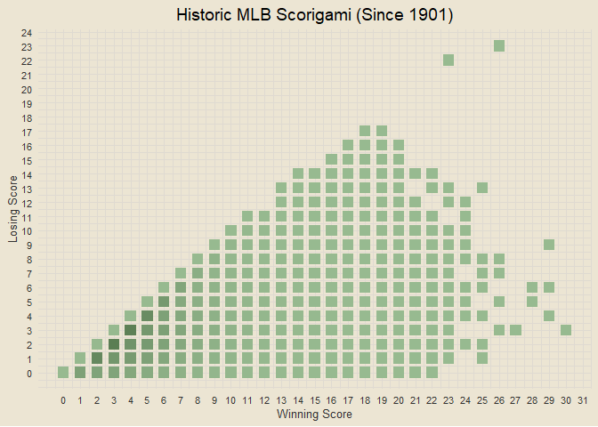
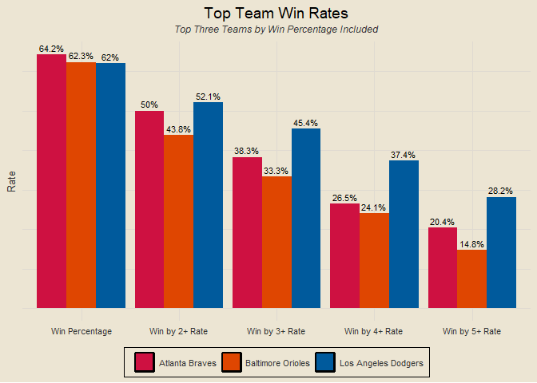
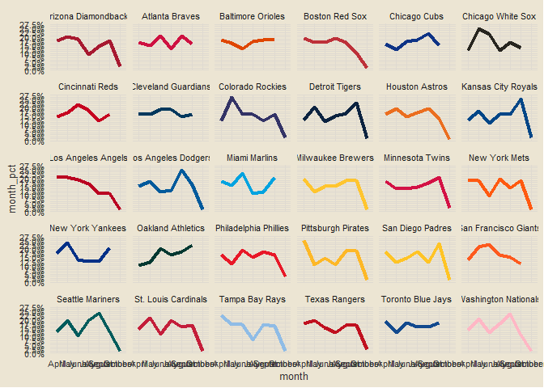
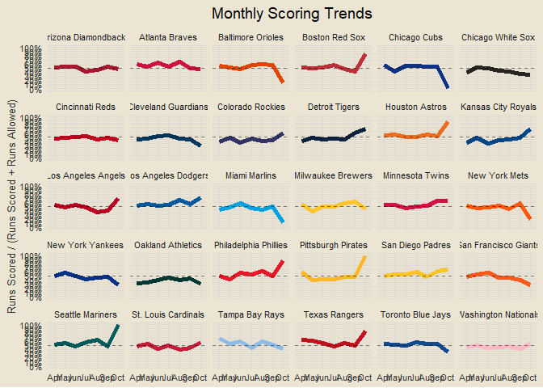
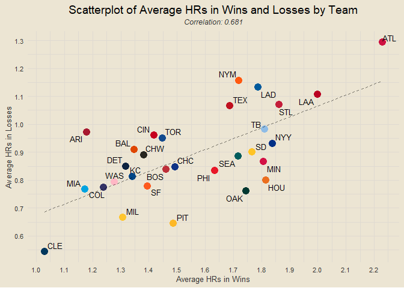
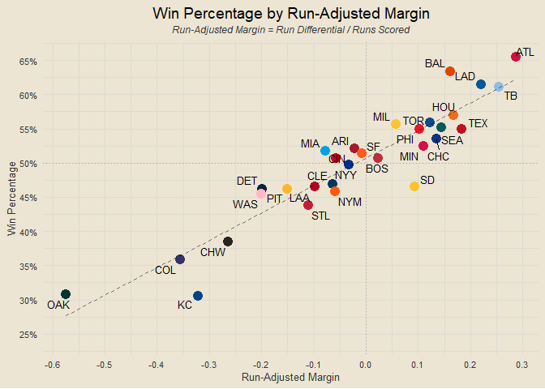
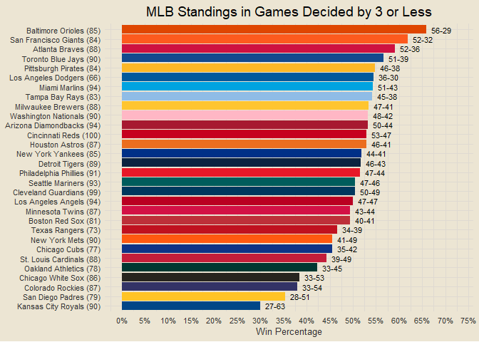

------------------------------------------------------------------------

**Data: MLB.com via {baseballr}**

------------------------------------------------------------------------

# Contents

- [Team Rankings](#team-rankings)
- [Runs Scored v Runs Allowed](#runs-scored-v-runs-allowed)
- [Composite Performance Rating (CPR)
  Rankings](#composite-performance-rating-cpr-rankings)
- [Records x CPR Ranks](#records-x-cpr-ranks)
- [Scorigami (2023 Only)](#scorigami-2023-only)
- [Historic MLB Scorigami (Since
  1901)](#historic-mlb-scorigami-since-1901)
- [Top Team Analysis](#top-team-analysis)
- [Team Margins Plot](#team-margins-plot)
- [Scatterplot of Margins of Victory and
  Defeat](#scatterplot-of-margins-of-victory-and-defeat)
- [Margins of Victory and Defeat](#margins-of-victory-and-defeat)
- [One-Run Games](#one-run-games)
- [Yesterday’s Highest-Scoring Game](#yesterdays-highest-scoring-game)
- [Best Records This Month](#best-records-this-month)
- [Runs Scored v Runs Allowed This
  Month](#runs-scored-v-runs-allowed-this-month)
- [Sudden Death Records](#sudden-death-records)
- [Eras Records](#eras-records)
- [First Inning Runs Scored v
  Allowed](#first-inning-runs-scored-v-allowed)
- [First Inning Runs Scored v Allowed
  Rates](#first-inning-runs-scored-v-allowed-rates)
- [First Inning Scoring](#first-inning-scoring)
- [Home and Away Performance](#home-and-away-performance)
- [Monthly v Season Win Percentages](#monthly-v-season-win-percentages)
- [Win Percentage v Run Differential as Percent of Runs
  Scored](#win-percentage-v-run-differential-as-percent-of-runs-scored)
- [Runs Scored in Wins and Losses](#runs-scored-in-wins-and-losses)
- [Win Percentage by Home Runs](#win-percentage-by-home-runs)
- [Win Percentage by Strikeouts](#win-percentage-by-strikeouts)
- [Home Runs by Strikeouts](#home-runs-by-strikeouts)
- [Home Runs in Wins and Losses](#home-runs-in-wins-and-losses)
- [When are teams scoring?](#when-are-teams-scoring)
- [Pythagorean Wins](#pythagorean-wins)
- [Close Games](#close-games)

### Team Rankings

<!-- -->

### Runs Scored v Runs Allowed

<!-- -->

### Composite Performance Rating (CPR) Rankings

<!-- -->

### Records x CPR Ranks

<!-- -->

### Scorigami (2023 Only)

<!-- -->

### Historic MLB Scorigami (Since 1901)

<!-- -->

### Top Team Analysis

<!-- -->

### Team Margins Plot

<!-- -->

### Scatterplot of Margins of Victory and Defeat

<!-- -->

### Margins of Victory and Defeat

<!-- -->

### One-Run Games

<!-- -->

### Yesterday’s Highest-Scoring Game

<!-- -->

### Best Records This Month

<!-- -->

### Runs Scored v Runs Allowed This Month

<!-- -->

### Sudden Death Records

<!-- -->

### Eras Records

<!-- -->

### First Inning Runs Scored v Allowed

<!-- -->

### First Inning Runs Scored v Allowed Rates

<!-- -->

### First Inning Scoring

<!-- -->

### Home and Away Performance

<!-- -->

### Monthly v Season Win Percentages

<!-- -->

### Win Percentage v Run Differential as Percent of Runs Scored

<!-- -->

### Runs Scored in Wins and Losses

<!-- -->

### Win Percentage by Home Runs

<!-- -->

### Win Percentage by Strikeouts

<!-- -->

### Home Runs by Strikeouts

<!-- -->

### Home Runs in Wins and Losses

<!-- -->

### When are teams scoring?

<!-- -->

### Which teams play the closest games?

<!-- -->

### Pythagorean Wins

<!-- -->

    ## [1] "Run-adjusted margin is more correlated than pythagorean wins (0.93 vs. 0.928)"

<!-- -->

``` r
get_run_adj_margin = function(team) {
  scored = get_runs_scored(team)
  allowed = get_runs_allowed(team)
  diff = scored - allowed
  adj = round(diff / scored, 3)
  return(adj)
}

team_ram = data.frame(team = all_teams) |>
  mutate(RAM = sapply(team, get_run_adj_margin)) |>
  arrange(desc(RAM))

ram_res = end_games |>
  mutate(win_team = ifelse(home_score > away_score, home_team, away_team)) |>
  inner_join(team_ram, by = c("home_team" = "team")) |>
  rename(home_RAM = RAM) |>
  inner_join(team_ram, by = c("away_team" = "team")) |>
  rename(away_RAM = RAM) |>
  mutate(RAM_win = ifelse(home_RAM > away_RAM, home_team, away_team)) |>
  count(win_team == RAM_win) |>
  pull(n)

paste0("RAM-only game prediction accuracy: ", round(ram_res[2] / sum(ram_res), 4) * 100, "%")
```

    ## [1] "RAM-only game prediction accuracy: 56.95%"

### Close Games

<!-- -->
